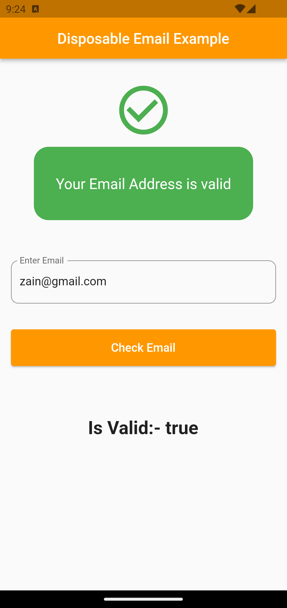
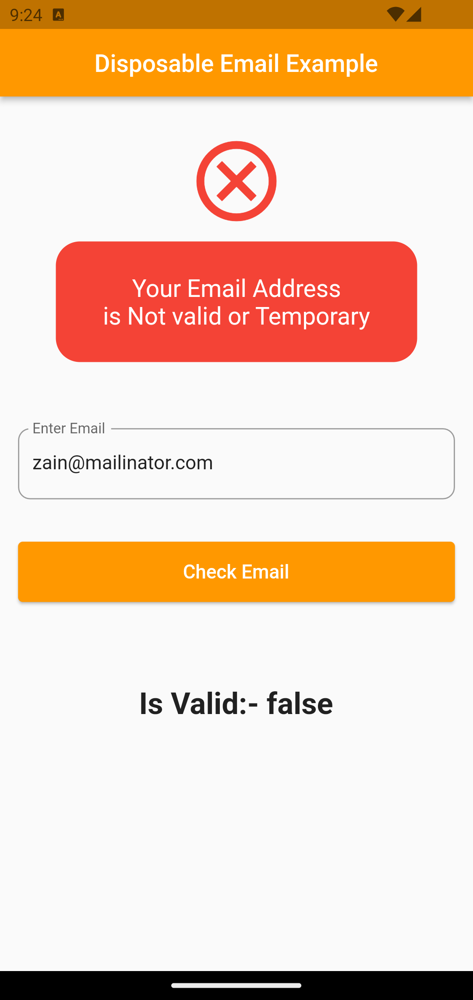

# Check Email disposable Package

This Package check the User Provided Email address is Disposable or Not

## What is a Disposable Email Address?

A Disposable Email Address (also known as a throwaway email, temporary email, or fake email address) is a type of email address that is used for a short period of time and is intended to be discarded after use. These email addresses are typically provided by various online services or websites to allow users to sign up for services or access content without using their primary or personal email address.

## Features

* [X] fake (temporary) email address check

## Installation

```
dependencies:
  check_disposable_email: ^0.0.1
```

## **Usage**

```
import'package:check_disposable_email/check_disposable_email.dart';


bool isValidEmail=Disposable.instance.hasValidEmail(here your email address);
```

```
if(isValidEmail){
   // TODO then do some task
}else{
   // TODO show email Error
}
```

## Screenshot


